# Weather-Data-Engineering-Project

**PURPOSE**
End to End Data Warehousing & reporting solution using Python, OCI Function’s & OCI Data Integration. 
The whole idea behind this solution is to reduce cost’s & make the pipeline highly scalable with near zero downtime

**SCOPE**
Using Python we are creating 2 different microservices 
1.	Extracting the semi-structured data from external API sources and converting them into structured csv format & storing it on Oracle Object Storage. 
2.	Transforming & Loading the transformed data into ADW (Autonomous Data Warehouse). 
Now we will be making the microservice using OCI Function’s so that we can invoke them as per our requirement. 
OCI Data Integration is used to design our pipeline where our OCI Function’s are getting invoked after that we create a schedule to run our data pipeline as per our needs.
TECHNOLOGY / PRE-REQUISITES
**Copy code:**
```
In order to enable this Solution, following technology must be available:
•	Python
•	Oracle Cloud Infrastructure (OCI Account) 
•	OCI Function’s
•	OCI Data Integration
•	Oracle Analytics Cloud
•	Oracle Object Storage
•	Oracle Autonomous Data Warehouse
•	API Source
In addition, following pre-requisites must be fulfilled:
•	Setting/Requesting all the required IAM Policies to use these above services.

```

**SOLUTION OVERVIEW:**

Let’s just discuss the step’s that we are going to perform in brief.

1.Data Extraction: Data is extracted from an API source using Python.

2. Data Collection: The Python code collects the weather data from the API, ensuring relevant parameters such as temperature, humidity, wind speed, etc., are captured accurately. The collected data is stored into Object Storage.

3. Data Loading: The collected weather data is loaded into Oracle Autonomous Data Warehouse (ADW) using Python.
The data is transformed into a suitable format for storage in ADW, ensuring proper mapping of fields and maintaining data integrity.

4. OCI Functions: The extraction and data loading processes are encapsulated as separate OCI Functions. These serverless functions provide scalability, flexibility, and cost-effectiveness by executing the code as required, triggered by events or scheduled intervals.

5. Orchestration with OCI DI: The OCI Data Integration (DI) service is utilized to orchestrate the data pipeline. It handles the coordination and scheduling of the OCI Functions, ensuring a smooth flow of data from extraction to loading.

6. Oracle Analytics Cloud (OAC): OAC is utilized as a reporting tool to generate meaningful insights from the data. Using OAC, reports and visualizations are created to analyze patterns, historical trends, and forecast predictions.

Overall, this project combines the power of Python, OCI Functions, OCI DI, ADW, and OAC to establish a robust and scalable data pipeline. It enables the extraction, loading, transformation, and reporting of weather data, providing valuable insights for improved decision-making and business outcomes.


**SOLULTION ARCHITECTURE**

The below architecture depicts how are we extracting the data from external API source & loading it into Autonomous Data Warehouse (ADW). 


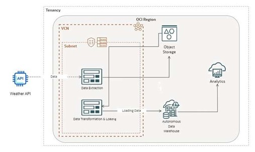


SOLULTION 
We will be using Weather API to demonstrate the whole solution

Step 1: Log into your RapidAPI Account

  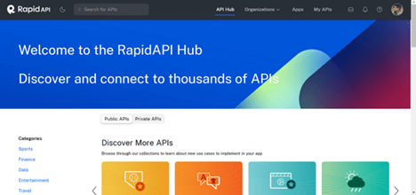

Step 2: Search for your API & Test the endpoint
Search for Weather API in RapidAPI Platform


   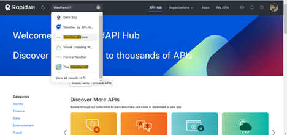

   
   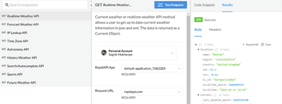


Test the endpoint of the WeatherAPI to see what is the response.
 


Step 3: Log into your Oracle Cloud Infrastructure Account.


   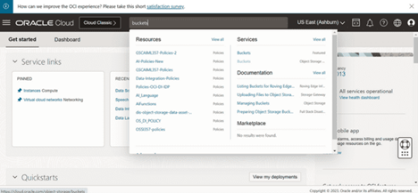

 
Step 4: Search for Object Storage Bucket.

   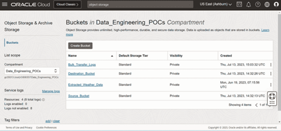
 

Step 5: Set up your ADW (Autonomous Data Warehouse) instance.

   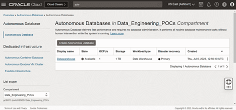

   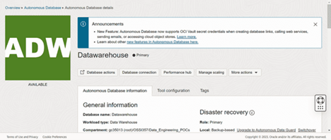

   
   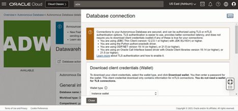


Download the wallet file from Database connection it will come handy later!
 
Step 6: Setup the Function Application & Start writing your functions!
[Note: You need to select a subnet]
 
   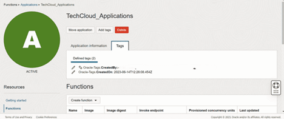
   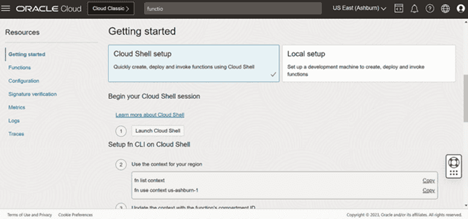


Execute the commands after launching the cloud shell!


Step 8: Write the WEATHERDATA DDL in the ADW.

   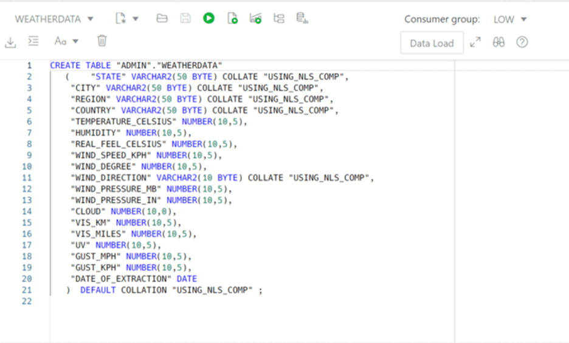


Step 9: Create REST Task’s to invoke the OCI Function’s & make a data pipeline!
 
 
   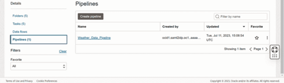
   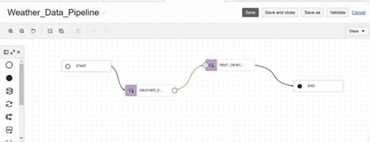


 
So as per our requirements we have created the REST Task’s for 
1.	Weather_Data_Extraction (This calls the endpoint to extract data from API)
2.	REST_OBJECTSTORAGE_TO_ADW(This calls the endpoint to transform and load data into ADW)
3.	Weather_Data_Pipeline_Task(This is the task for the pipeline)
 


Step 10: Schedule the pipeline

   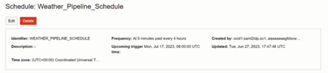

 

Step 11: Run the pipeline once to check if the get’s loaded to ADW
 
Voila it’s working!!


Step 12: Now create an Oracle Analytics Instance & connect the ADW instance with it!

 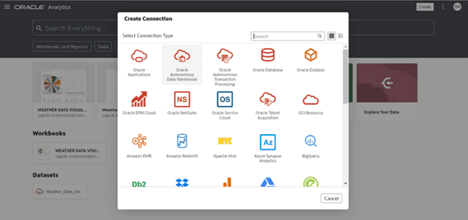

 
 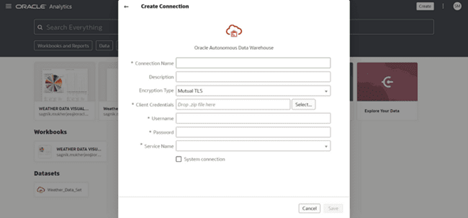

 
[Note: Remember the wallet we have downloaded in Step 6 use that credentials to make an connection]
 
Step 13: After establishing the connection start making your visualization’s!
 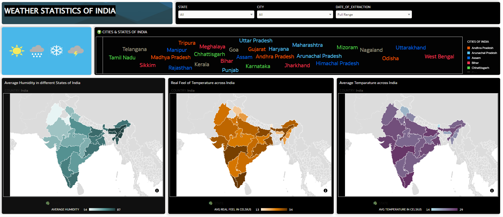


Conclusion: 
This show’s how we can build simple microservice driven Data pipeline using Python, OCI Functions & OCI Data Integration. This solution is simple, easy to implement, faster to implement, saves a ton of cost & it has near 0 down time as the whole thing is built on top of serverless architecture.

